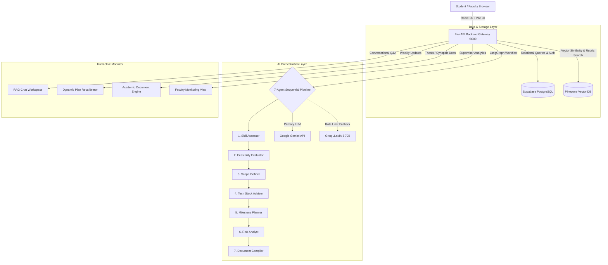

# AI-Guided Academic Project Progress Tracking Platform with Planning & Mentorship Assistance

[](file:///d:/ai-academic-project/Agile%20Document/Agile_Template_v0.1.xlsx)
[](file:///d:/ai-academic-project/Agile%20Document/Agile_Template_v0.1.xlsx)
[](https://fastapi.tiangolo.com/)
[](https://vitejs.dev/)
[](https://www.langchain.com/langgraph)
[](https://supabase.com/)
[](https://www.pinecone.io/)

---

## 📌 Project Overview & Problem Statement

Students frequently face significant challenges while selecting, planning, executing, and documenting academic projects. Many projects fail not because of technical difficulty, but due to **poor planning, unclear objectives, unrealistic timelines, improper technology selection, and insufficient mentorship**. Faculty members often supervise multiple teams simultaneously, limiting personalized guidance available to each student group.

The **AI-Guided Academic Project Progress Tracking Platform with Planning & Mentorship Assistance** is an intelligent, agentic platform that guides students through the complete academic project lifecycle:
1. A student submits a rough project idea in **2–3 lines**.
2. The platform automatically triggers a **multi-agent AI pipeline** that evaluates feasibility, defines scope, recommends optimal technology stacks, generates a week-wise milestone roadmap with Mermaid Gantt charts, and identifies execution risks — producing a complete project blueprint without additional prompting.
3. Post-planning, students interact conversationally for **ongoing guidance, progress tracking (dynamic plan adjustment), weekly check-ins, and on-demand academic documentation generation**.
4. Faculty mentors access a **dedicated monitoring dashboard** for passive, real-time oversight of all student projects, health indicators, and auto-generated weekly summaries.

---

## 📚 Central Documentation Hub

All detailed technical specifications, API schemas, and architectural guides are organized in the [`docs/`](docs/) directory:

| Resource | Document | Description |
| :--- | :--- | :--- |
| **System Architecture** | [`docs/ARCHITECTURE.md`](docs/ARCHITECTURE.md) | LangGraph 7-agent state machine, Pinecone RAG topology & circuit breaker. |
| **API Specification** | [`docs/API_REFERENCE.md`](docs/API_REFERENCE.md) | Complete REST API reference, request/response models & status codes. |
| **Database & ERD** | [`docs/DATABASE_SCHEMA.md`](docs/DATABASE_SCHEMA.md) | Normalized Supabase schemas, PostgreSQL views & Mermaid ER diagram. |
| **Frontend Guide** | [`docs/FRONTEND_GUIDE.md`](docs/FRONTEND_GUIDE.md) | React 18, Vite, Tailwind CSS design tokens & component tree. |
| **Agile & QA Hub** | [`docs/AGILE_MANAGEMENT.md`](docs/AGILE_MANAGEMENT.md) | Sprint burndown velocity metrics, defect resolution & test matrices. |
| **Engineering Standards**| [`docs/CONTRIBUTING.md`](docs/CONTRIBUTING.md) | GitFlow branching, Conventional Commits & PR review checklist. |
| **Security Policies** | [`docs/SECURITY.md`](docs/SECURITY.md) | JWT auth protocols, bcrypt password hashing & data governance. |

---

## 🎯 Key Project Outcomes

1. **Autonomous Multi-Agent AI Pipeline:** Converts a rough 2-3 line project idea into an actionable, structured project blueprint automatically.
2. **Conversational AI Mentoring & Dynamic Tracking:** Context-aware RAG mentoring chat for ongoing technical guidance; student updates automatically recalibrate the project schedule.
3. **On-Demand Academic Documentation Generation:** Instantly compiles university-standard Synopses, Methodology Reports, Progress Reports, and Thesis Outlines with downloadable Markdown/PDF formats.
4. **Faculty Monitoring & Project Health Dashboard:** Centralized dashboard for academic supervisors providing passive tracking, real-time health indicators (Green/Amber/Red), and auto-generated weekly mentor summaries.

---

## 🧩 Modules Implemented

1. **Student Profile and Skill Assessment Module:** User registration, profile management, and interactive technical skill assessment scoring.
2. **Project Idea Submission and Feasibility Analysis Agent:** Split-screen proposal submission and automated technical/time feasibility evaluation.
3. **Project Scope Definition and Technology Stack Recommendation Agent:** MVP deliverable demarcation, boundary definition, and trade-off justified technology stack recommendation.
4. **Milestone and Timeline Planning Agent:** Week-by-week schedule generation with native Mermaid.js Gantt chart visual rendering.
5. **Risk Assessment and Mitigation Agent:** Proactive blocker identification, dependency risk scoring, and contingency planning.
6. **Conversational Mentor Interaction Module:** Context-grounded RAG chat workspace integrating uploaded syllabus/rubric PDFs and project state memory.
7. **Documentation and Report Generation Module:** Academic synopsis, methodology, and progress report generator adhering to university thesis guidelines.
8. **Faculty Monitoring Dashboard:** Supervisor dashboard for tracking team velocity, project status badges, and weekly executive summaries.

---

## 🗓️ Project Milestones & Sprints

### Milestone Breakdown
* **Milestone 1 (Weeks 1–2 \| May 27 – Jun 09, 2026 \| ~10 Hours/member):**
  1. Study agentic AI workflows and academic project mentoring methodologies.
  2. Design multi-agent system architecture, agent roles, and student-project data models in Supabase.
  3. Develop student onboarding — profile creation and skill assessment functionality.
  4. Implement project idea submission interface and trigger mechanism for the agent pipeline.
* **Milestone 2 (Weeks 3–4 \| Jun 10 – Jun 23, 2026 \| ~10 Hours/member):**
  1. Develop Feasibility Analysis Agent and Scope Definition Agent.
  2. Implement Technology Stack Recommendation Agent with reasoning output.
  3. Build Milestone and Timeline Planning Agent — generates week-wise execution plan with Mermaid Gantt charts.
  4. Validate end-to-end pipeline using sample student project ideas.
* **Milestone 3 (Weeks 5–8 \| Jun 24 – Jul 21, 2026 \| ~20 Hours/member):**
  1. Develop Risk Assessment and Mitigation Agent — identifies blockers and suggests resolutions.
  2. Implement conversational mentor interaction for ongoing weekly student check-ins (RAG + Pinecone).
  3. Build progress tracking — student updates trigger dynamic plan adjustments via the agent pipeline.
  4. Develop on-demand documentation generation for synopsis, methodology, and progress reports.
* **Milestone 4 (Weeks 9–13 \| Jul 22 – Aug 24, 2026 \| ~20 Hours/member):**
  1. Develop faculty monitoring dashboard — project health indicators and auto-generated mentor summaries.
  2. Conduct end-to-end testing across all agents, fallback mechanisms, and interaction workflows.
  3. Optimize agent prompt quality, response accuracy, and pipeline reliability (Gemini + Groq fallback).
  4. Prepare technical documentation, project report, defect remediation, and final demonstration.

---

## 🏆 Evaluation Criteria Compliance

| Evaluation Criteria | Implementation Detail & Verification | Status |
| :--- | :--- | :---: |
| **1. Quality and accuracy of automated blueprint** | Single 2–3 line student proposal produces structured Feasibility, Scope, Stack, Gantt Timeline, Risk Matrix, and Master README blueprint. | ✅ Verified |
| **2. Effectiveness of individual agents** | Modular LangGraph agents with specialized system prompts, Pydantic schemas, and structured trade-off justifications. | ✅ Verified |
| **3. Conversational mentoring & progress guidance** | RAG-enabled Pinecone chat with PDF document context injection; `/progress_update` recalibrates future milestone weeks dynamically. | ✅ Verified |
| **4. Auto-generated documentation & faculty dashboard** | On-demand academic Synopsis, Methodology, and Progress reports; faculty portal with real-time health indicators (Green/Amber/Red). | ✅ Verified |
| **5. Completeness of testing & documentation** | 22 Automated Unit Test Cases ([Unit_Test_Plan_v0.1.xlsx](file:///d:/ai-academic-project/Agile%20Document/Unit_Test_Plan_v0.1.xlsx)), 18 Resolved Defects ([Defect_Tracker Template_v0.1.xlsx](file:///d:/ai-academic-project/Agile%20Document/Defect_Tracker%20Template_v0.1.xlsx)), and full Agile management artifacts. | ✅ Verified |

---

## 🏗️ System Architecture




---

## 🛠️ Technology Stack

* **Frontend:** React 18.2, Vite, Tailwind CSS, Axios, Lucide React, Mermaid.js.
* **Backend:** FastAPI, Uvicorn, Pydantic, Python-dotenv.
* **AI Orchestration & Agents:** LangGraph, LangChain, Google Gemini API, Groq API (fallback).
* **Vector Store & Embeddings:** Pinecone Serverless, SentenceTransformers (`all-MiniLM-L6-v2`).
* **Database & Auth:** Supabase PostgreSQL (Normalized tables: `student`, `skill_assessment`, `project_idea`).

---

## 📡 API Service Endpoints

The backend is served at `http://localhost:8000`.

### Core Onboarding & Authentication
| Endpoint | Method | Description |
| :--- | :--- | :--- |
| `/` | `GET` | System health check and root message |
| `/auth/register` | `POST` | Registers a new student account (bcrypt hashed) |
| `/auth/login` | `POST` | Authenticates student and returns JWT access token |
| `/onboard` | `POST` | Submits profile, skill assessments, and initial project proposal |
| `/student/{id}` | `GET` | Fetches normalized profile, skills, and project data |

### Multi-Agent Pipeline & Planning
| Endpoint | Method | Description |
| :--- | :--- | :--- |
| `/initialize` | `POST` | Executes the full 7-agent LangGraph initialization pipeline |
| `/upload` | `POST` | Ingests PDF reference files (syllabi, rubrics) into Pinecone for RAG |

### Interactive Mentoring & Document Generation
| Endpoint | Method | Description |
| :--- | :--- | :--- |
| `/chat` | `POST` | Context-aware RAG chat workspace with the AI Mentor |
| `/progress_update`| `POST` | Submits weekly student updates & dynamically recalibrates the project plan |
| `/check_in` | `POST` | Triggers weekly mentor evaluation, praise, and upcoming goals |
| `/generate_document`| `POST` | Generates university-standard Synopsis, Methodology, Progress Report, or Thesis Outline |

### Faculty Supervision
| Endpoint | Method | Description |
| :--- | :--- | :--- |
| `/faculty/dashboard`| `GET` | Fetches aggregate monitoring overview, project health indicators, and summaries |

---

## 📂 Agile Project Documentation

All Agile artifacts are available in the [`Agile Document/`](file:///d:/ai-academic-project/Agile%20Document/) folder:

1. **[Agile_Template_v0.1.xlsx](file:///d:/ai-academic-project/Agile%20Document/Agile_Template_v0.1.xlsx)**
   - **`Product Backlog`**: 20 User Stories across Sprints 1–6 with MoSCoW priorities and assignees.
   - **`Sprint Backlog`**: 37 detailed engineering tasks with Day 1–14 burndown effort curves.
   - **`Stand up Meeting`**: 20 daily standup entries with technical impediments and action items.
   - **`Retrospection`**: 14 sprint retrospectives covering Start, Stop, Continue, and Action Taken.
2. **[Defect_Tracker Template_v0.1.xlsx](file:///d:/ai-academic-project/Agile%20Document/Defect_Tracker%20Template_v0.1.xlsx)**
   - 18 resolved defect tickets with root-cause analysis, defect types, and verification remarks.
3. **[Unit_Test_Plan_v0.1.xlsx](file:///d:/ai-academic-project/Agile%20Document/Unit_Test_Plan_v0.1.xlsx)**
   - 22 comprehensive unit test cases covering all modules, endpoints, and fallback mechanisms.

---

## 🚀 Quick Start & Installation Guide

### Prerequisites
* **Python 3.10+**
* **Node.js 18+** & npm

### 1. Configure Environment Variables
Create a `.env` file in the project root:
```env
SUPABASE_URL="https://your-supabase-project.supabase.co"
SUPABASE_KEY="your-supabase-anon-key"
PINECONE_API_KEY="your-pinecone-api-key"
PINECONE_INDEX_NAME="your-pinecone-index-name"
GEMINI_API_KEY="your-google-gemini-api-key"
GROQ_API_KEY="your-groq-api-key"
```

### 2. Setup Python Backend
```bash
python -m venv venv
.\venv\Scripts\Activate.ps1   # Windows PowerShell
pip install -r requirements.txt
```

### 3. Setup Frontend
```bash
cd frontend
npm install
```

### 4. Run Full Stack Concurrently
From the project root:
```bash
npm run dev
```
* **Frontend Portal:** `http://localhost:5173`
* **FastAPI Backend:** `http://localhost:8000`
* **Interactive API Docs (Swagger):** `http://localhost:8000/docs`
