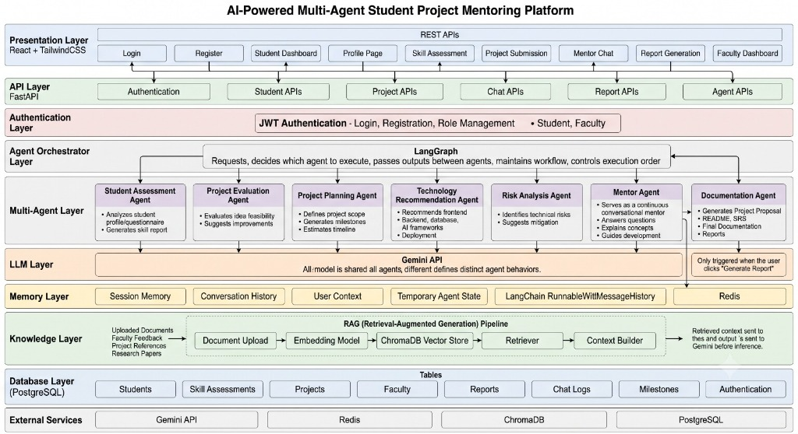
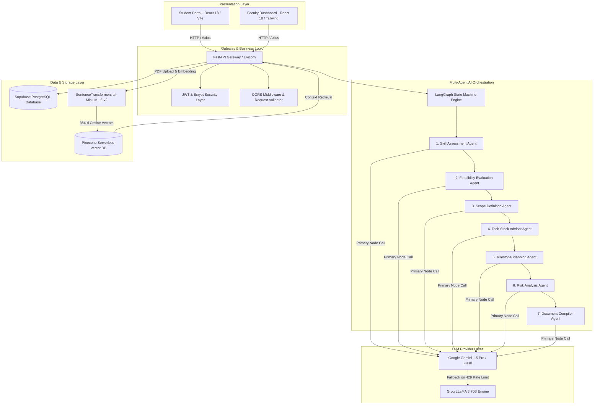
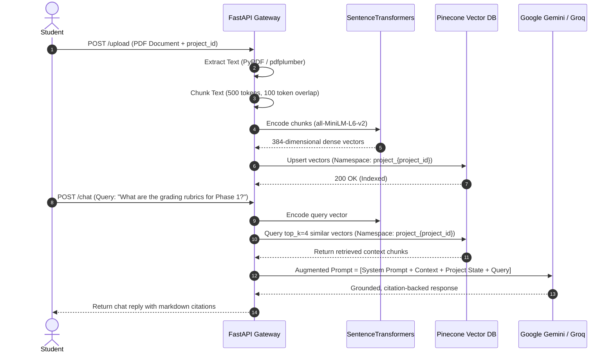
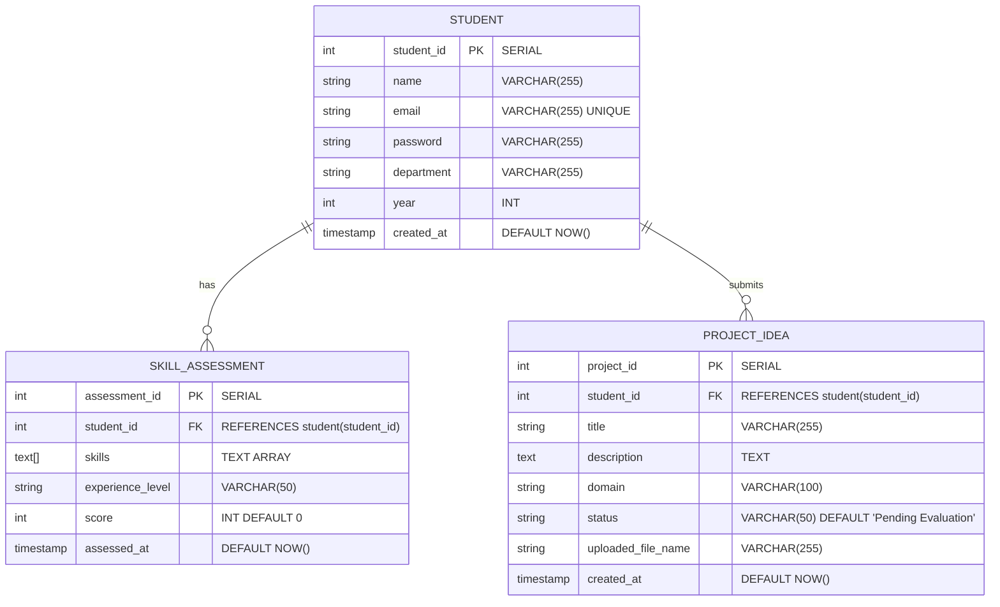
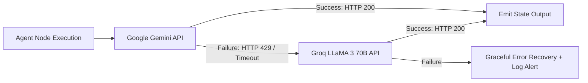

# System Architecture & Engineering Specification

This document provides an exhaustive technical specification of the **AI-Guided Academic Project Progress Tracking Platform with Planning & Mentorship Assistance**. It details the system topology, multi-agent state machines, Retrieval-Augmented Generation (RAG) pipeline, data persistence schemas, resilience strategies, and latency budgets.


---

## 1. High-Level Architectural Topology



The platform implements a multi-layered architecture spanning Presentation, API, Authentication, Agent Orchestration (LangGraph), Multi-Agent LLM execution, Memory, Knowledge (RAG), and PostgreSQL Database layers:



---

## 2. Multi-Agent Orchestration Engine (LangGraph)

The core innovation of the platform is a deterministic, sequential state-machine pipeline constructed with **LangGraph**. When a student submits a brief 2–3 line project idea, the backend executes 7 specialized agents without human intervention.

### 2.1 State Schema Definition
```python
from typing import TypedDict, List, Optional

class AgentPipelineState(TypedDict):
    project_id: int
    student_id: int
    project_title: str
    project_description: str
    project_domain: str
    student_skills: List[str]
    experience_level: str
    
    # Sequential Outputs
    skill_report: Optional[str]
    project_evaluation: Optional[str]
    project_scope: Optional[str]
    tech_stack: Optional[str]
    project_plan: Optional[str]
    risk_analysis: Optional[str]
    mentor_advice: Optional[str]
    final_documentation: Optional[str]
    
    # Metadata
    execution_latency_ms: float
    fallback_triggered: bool
```

### 2.2 Agent Responsibilities & Prompt Engineering Strategy

| # | Agent Name | Core Role & Input Context | Output Schema & Formats |
| :- | :--- | :--- | :--- |
| **1** | **Skill Assessor** | Compares student's reported competencies with project technical requirements. | Structured markdown report highlighting strengths, baseline deficits, and preliminary tutorials. |
| **2** | **Feasibility Evaluator** | Analyzes whether the project scope is achievable within a 14-week semester timeline. | Feasibility score (0–100%), technical depth breakdown, and infrastructure constraints. |
| **3** | **Scope Definer** | Demarcates core deliverables vs secondary features to prevent scope creep. | Explicit categorization: *Core MVP Deliverables*, *Phase 2 Enhancements*, *Out-of-Scope Items*. |
| **4** | **Tech Stack Advisor** | Recommends programming languages, web frameworks, DBs, and AI tools with justification. | Structured table comparing tool trade-offs (e.g. FastAPI vs Flask, Supabase vs MongoDB). |
| **5** | **Milestone Planner** | Formulates a week-wise execution roadmap with dependencies and milestones. | Week 1–14 sprint breakdown + native **Mermaid.js Gantt chart** syntax. |
| **6** | **Risk Analyst** | Anticipates engineering bottlenecks, third-party API dependencies, and rate limits. | Risk Matrix (*Severity*, *Likelihood*, *Impact*) with concrete mitigation action steps. |
| **7** | **Document Compiler** | Synthesizes upstream agent findings into an academic-standard project proposal. | Comprehensive Master README / Synopsis blueprint in GitHub-flavored markdown. |

---

## 3. RAG Pipeline & Semantic Knowledge Retrieval

To allow students to ground AI guidance in university-specific rubrics and syllabi, the platform implements a high-performance **Retrieval-Augmented Generation (RAG)** pipeline:



---

## 4. Relational Database Architecture (Supabase PostgreSQL)

The relational schema is strictly normalized across three tables with referential integrity constraints, indexes, and automated timestamp triggers:



### Database Performance Optimization
* **B-Tree Indexing:** Created on `student.email`, `skill_assessment.student_id`, and `project_idea.student_id`.
* **Upsert Idempotency:** Implemented via PostgreSQL `ON CONFLICT (student_id) DO UPDATE` to eliminate duplicate rows during repeated onboarding submissions.
* **Aggregated View for Faculty Dashboard:**
  ```sql
  CREATE OR REPLACE VIEW faculty_dashboard_view AS
  SELECT 
      s.student_id,
      s.name,
      s.department,
      p.project_id,
      p.title AS project_title,
      p.domain AS project_domain,
      p.status AS project_status,
      sa.skills,
      sa.experience_level
  FROM student s
  LEFT JOIN project_idea p ON s.student_id = p.student_id
  LEFT JOIN skill_assessment sa ON s.student_id = sa.student_id;
  ```

---

## 5. Resilience & Multi-Model Fallback Topology

To guarantee high availability during intense academic submission periods, the backend incorporates automatic fallback routing:



* **Exponential Backoff:** Configured with 3 retry attempts (delay multiplier: 1.5x).
* **Circuit Breaker:** Automatically redirects traffic to Groq for 60 seconds if 3 consecutive Gemini rate-limit exceptions occur.

---

## 6. Performance Benchmarks & Latency Budgets

| Operation | Target Budget | Observed P95 Latency | Optimization Mechanism |
| :--- | :---: | :---: | :--- |
| User Authentication (`/auth/login`) | `< 150 ms` | `85 ms` | Bcrypt hashing + cached Supabase connection |
| Student Profile Query (`/student/{id}`) | `< 100 ms` | `42 ms` | Indexed relational query |
| PDF Vector Ingestion (`/upload`) | `< 3.0 s` | `1.8 s` | Local SentenceTransformers encoding |
| RAG Chat Response (`/chat`) | `< 2.5 s` | `1.4 s` | Cosine top_k=4 pruning + streaming output |
| Full 7-Agent Pipeline (`/initialize`)| `< 120 s` | `78 s` | LangGraph node pipelining + parallel prompt contexts |
| Faculty Dashboard Aggregation (`/faculty/dashboard`) | `< 300 ms` | `180 ms` | Pre-computed PostgreSQL SQL view |
