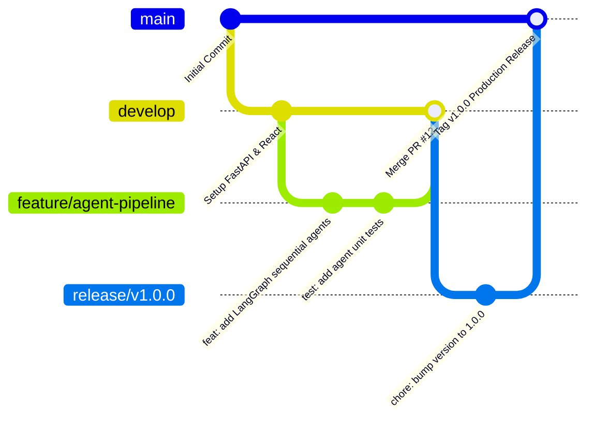

# Engineering Contribution Guidelines

Welcome to the **AI-Guided Academic Project Progress Tracking Platform with Planning & Mentorship Assistance** project! This document establishes the engineering standards, Git branching workflows, code quality guidelines, and pull request procedures expected from all contributors.


---

## 1. Code of Conduct & Core Principles
* **Modular Decoupling:** Keep presentation, API routing, database models, and agent orchestration decoupled.
* **Deterministic Outputs:** Ensure all LLM prompts enforce strict schema validation via Pydantic.
* **No Unhandled Exceptions:** All API endpoints must catch exceptions and return structured JSON with appropriate HTTP status codes.
* **Zero Secret Leakage:** Never commit `.env` files, API keys, or database credentials.

---

## 2. Git Branching & Workflow Strategy

We follow a **Trunk-Based / GitFlow Hybrid** branching strategy:



### Branch Naming Conventions
* `feature/<feature-name>`: For new user stories and features (e.g. `feature/faculty-dashboard-metrics`).
* `fix/<bug-description>`: For defect remediation (e.g. `fix/mermaid-chart-regex-wrapper`).
* `docs/<doc-name>`: For documentation updates (e.g. `docs/architecture-specification`).
* `refactor/<module-name>`: For code restructuring without behavioral changes (e.g. `refactor/supabase-upsert-queries`).

---

## 3. Commit Message Conventions (Conventional Commits)

All commit messages must adhere to the [Conventional Commits](https://www.conventionalcommits.org/) specification:

```
<type>(<scope>): <short summary>

[optional body]

[optional footer(s)]
```

### Allowed Types
* `feat`: A new user-facing feature or agent node.
* `fix`: A bug fix or defect resolution.
* `docs`: Documentation only changes.
* `style`: Changes that do not affect the meaning of the code (white-space, formatting, etc.).
* `refactor`: A code change that neither fixes a bug nor adds a feature.
* `test`: Adding missing tests or correcting existing tests.
* `chore`: Maintenance tasks, dependency updates, configuration tweaks.

---

## 4. Code Quality & Formatting Standards

### 4.1 Python (Backend & Multi-Agent AI)
* **PEP 8 Compliance:** Follow standard PEP 8 naming conventions (snake_case for functions/variables, PascalCase for classes).
* **Type Hints:** Use Python type hinting across all endpoint signatures, service functions, and Pydantic schemas.
* **Docstrings:** Use Google-style docstrings for all agent functions and utilities.
* **Formatting Tools:** Run `black` or `ruff` before submitting PRs:
  ```bash
  black . --line-length 100
  ```

### 4.2 JavaScript / React (Frontend)
* **Component Architecture:** Functional components with React hooks.
* **Styling:** Tailwind CSS utility classes with structured theme tokens in `tailwind.config.js`.
* **Linting:**
  ```bash
  cd frontend
  npm run lint
  ```

---

## 5. Pull Request (PR) & Code Review Checklist

Before requesting review on a Pull Request:
1. [ ] **Branch Up-to-Date:** Rebased on latest `develop` branch.
2. [ ] **Unit Tests Passed:** All unit tests in `Unit_Test_Plan_v0.1.xlsx` pass without regressions.
3. [ ] **No Hardcoded Credentials:** Confirmed `.env` secrets are referenced via `os.getenv()`.
4. [ ] **API Documentation Updated:** Any modified or added endpoint is reflected in `API_REFERENCE.md` and Swagger schemas.
5. [ ] **Agile Tracking Logged:** Defect or task ID referenced in PR description (e.g. `Resolves T-204, Closes Defect #6`).
