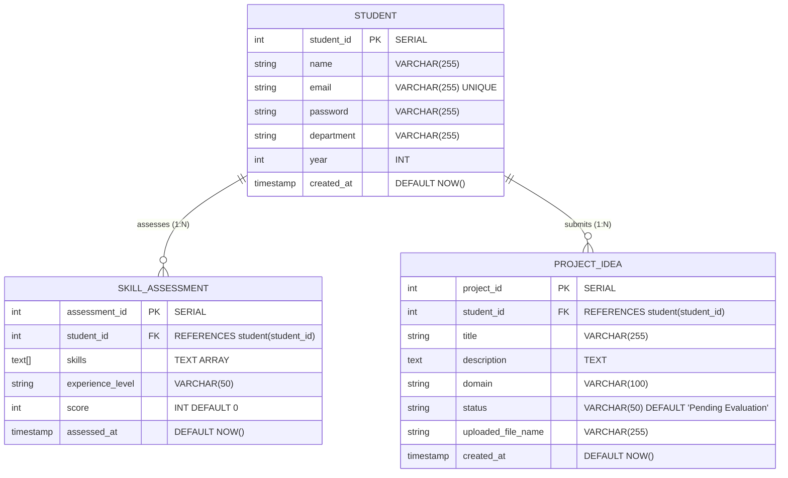

# Backend & Database Architecture Documentation

This document outlines the database schema, relational models, and service architecture for the **AI-Guided Academic Project Progress Tracking Platform with Planning & Mentorship Assistance** backend.

---

## 🗄️ Database Schemas (Supabase PostgreSQL)

Data is strictly normalized across three core tables to support multi-agent querying and state management.

### Entity Relationship (ER) Diagram

---

### Table Specifications

#### 1. `student` Table
Stores core student identity and authentication credentials.
| Column | Type | Constraints | Description |
| :--- | :--- | :--- | :--- |
| `student_id` | SERIAL | PRIMARY KEY | Unique student identifier |
| `name` | VARCHAR(255) | NOT NULL | Full name of the student |
| `email` | VARCHAR(255) | UNIQUE, NOT NULL | Student email (login credential) |
| `password` | VARCHAR(255) | NOT NULL | Bcrypt hashed password |
| `department` | VARCHAR(255) | NOT NULL | Academic department (e.g. Computer Science) |
| `year` | INT | NOT NULL | Current academic year (e.g. 1–4) |
| `created_at` | TIMESTAMP | DEFAULT NOW() | Record creation timestamp |

#### 2. `skill_assessment` Table
Stores the student's evaluated technical competencies.
| Column | Type | Constraints | Description |
| :--- | :--- | :--- | :--- |
| `assessment_id`| SERIAL | PRIMARY KEY | Unique assessment record identifier |
| `student_id` | INT | FOREIGN KEY → `student.student_id` | Reference to parent student |
| `skills` | TEXT[] | NOT NULL | Array of reported technical skills |
| `experience_level`| VARCHAR(50)| NOT NULL | Skill tier (`Beginner`, `Intermediate`, `Advanced`) |
| `score` | INT | DEFAULT 0 | Calculated quiz competency score (0–100) |
| `assessed_at` | TIMESTAMP | DEFAULT NOW() | Assessment timestamp |

#### 3. `project_idea` Table
Stores submitted project proposals, generated blueprints, and uploaded document references.
| Column | Type | Constraints | Description |
| :--- | :--- | :--- | :--- |
| `project_id` | SERIAL | PRIMARY KEY | Unique project record identifier |
| `student_id` | INT | FOREIGN KEY → `student.student_id` | Submitting student |
| `title` | VARCHAR(255) | NOT NULL | Proposed project title |
| `description` | TEXT | NOT NULL | 2–3 line rough project description |
| `domain` | VARCHAR(100) | NOT NULL | Domain category (e.g., Agentic AI, Web, ML) |
| `status` | VARCHAR(50) | DEFAULT 'Pending Evaluation' | Project state (`Pending`, `Initialized`, `Active`) |
| `uploaded_file_name`| VARCHAR(255)| NULLABLE | Ingested PDF filename for RAG context |
| `created_at` | TIMESTAMP | DEFAULT NOW() | Proposal creation timestamp |

---

## 🌲 Vector Database (Pinecone)

* **Index Name:** `academic-mentor-index`
* **Embedding Model:** `sentence-transformers/all-MiniLM-L6-v2`
* **Vector Dimensions:** `384`
* **Distance Metric:** `Cosine`
* **Namespace Scoping:** Scoped per `project_id` for isolated RAG document retrieval.

---

## 🤖 Multi-Agent Orchestration (LangGraph)

The backend utilizes a sequential state-machine pipeline comprising 7 specialized agents:
1. **Skill Assessor:** Evaluates technical competency alignment.
2. **Feasibility Evaluator:** Assesses technical complexity and semester time viability.
3. **Scope Definer:** Sets core MVP boundaries and stretch goals.
4. **Tech Stack Advisor:** Recommends frameworks, databases, and libraries with rationale.
5. **Milestone Planner:** Generates week-by-week execution roadmap with Mermaid Gantt charts.
6. **Risk Analyst:** Identifies blockers and mitigation action plans.
7. **Document Compiler:** Aggregates upstream outputs into master blueprint markdown.

*Fallback Resilience:* Automatic fallback to **Groq LLaMA 3 70B** on Google Gemini API rate limits (HTTP 429).
